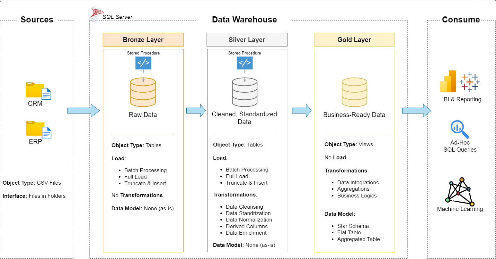
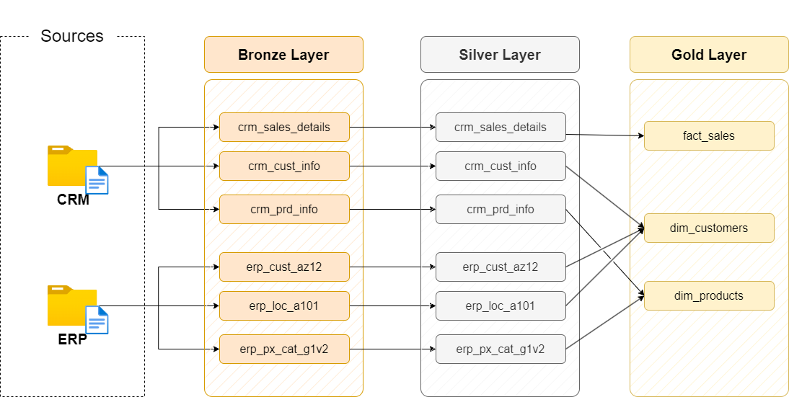

# 📦 Welcome to the Sales Data Warehouse Project!

Welcome to my beginner-friendly Data Warehouse project! This project is designed to help understand the fundamentals of data warehousing through a real-world **sales analytics use case**.

---

## 📘 About the Project

This project builds a **Sales Data Warehouse** for an online retail store using a **Star Schema** design. It demonstrates the **ETL (Extract, Transform, Load)** process, dimensional modeling, SQL-based data analysis, and reporting through tools like **Power BI** or **Excel**.

The core goal is to simulate how data engineers and analysts work with structured data in enterprise environments for **Business Intelligence**.

---

## 🧠 Key Architecture

### 1. Modern Data Warehouse Architecture

- Raw data from CRM and ERP systems is ingested into the **Bronze Layer**
- Transformed and cleansed in the **Silver Layer**
- Aggregated and business-ready in the **Gold Layer**
- Final outputs are used for **BI tools**, **SQL queries**, and **ML models**

---

### 2. Table Lineage Across Layers

- Visual representation of how tables move from **Bronze ➝ Silver ➝ Gold**
- Tracks each table’s transformation lifecycle

---

### 3. Star Schema Design (Fact & Dimension)

- This is the final data model in the **Gold Layer**
- Consists of:
  - `dim_customers`
  - `dim_products`
  - `fact_sales`
- Enables fast and flexible analytics with calculated metrics like:
  - **Sales Amount = Quantity × Price**

---

## 📂 Folder Structure Summary

datasets/ # Raw and cleaned data files
scripts/ # SQL scripts for DDL and ETL
tests/ # Test scripts and validation queries
docs/ # Architecture diagrams, conventions, metadata
README.md # Project intro and instructions

---

## ✅ Requirements

To run or explore this project, you'll need the following:

- Python 3.8+
- SQL Server
- `pandas` for data processing
- `psycopg2` or `pyodbc` for DB connectivity
- Jupyter Notebook or VS Code (optional)
- Power BI / Tableau / Excel for visualization
- Git (to clone this repo)

---

## 🎯 Objectives

- Understand the fundamentals of data warehousing  
- Build a **star schema** (Fact + Dimension tables)  
- Perform **ETL** using Python  
- Load structured data into a relational database  
- Write **OLAP-style SQL queries** for reporting  
- Create **visual dashboards** using BI tools  

---

## 🗂️ Additional Documentation

### 📊 Layered Design PDF
📎 [View PDF](./docs/data_layers.pdf)

---

### 📚 Naming Conventions

To maintain consistency across schema objects, the following naming conventions are followed:

🔗 [Naming Conventions Documentation](./docs/naming_conventions.md)

---

### 🧾 Data Catalog

Includes metadata and descriptions of tables, columns, and business definitions.

🔗 [Data Catalog](./docs/data_catalog.md)

---

## 👤 About Me

Hi! I’m a final year student of B.E. in Artificial Intelligence and Data Science.  
This is one of my academic and skill-building projects in **Data Engineering** and **Business Intelligence**.

📧 Feel free to connect or reach out:  
- [LinkedIn](https://www.linkedin.com/in/pravin-kawthale-ba9787337/)  
- [GitHub](https://github.com/pravin-kavthale)  
- [Email](mailto:kavthalepravin@gmail.com)

---

> ⭐ If you like this project or found it useful, feel free to **star the repo** and share feedback!
